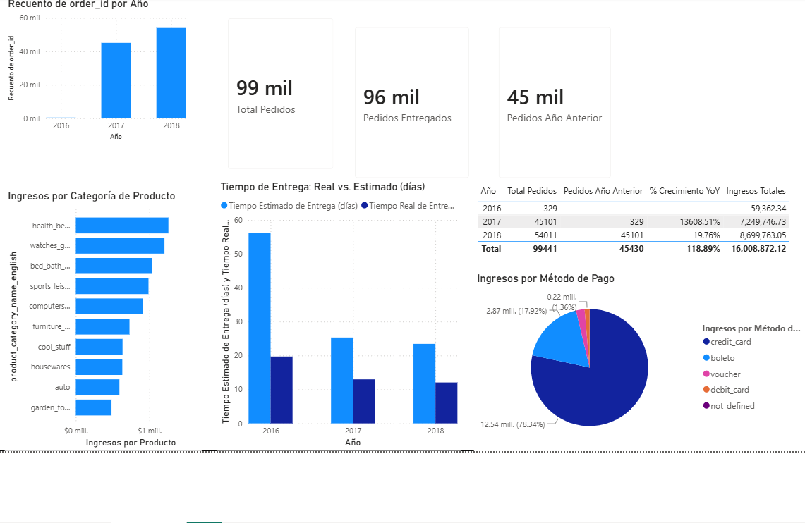

# 03 · Dashboard Power BI — Olist E-Commerce

> Dashboard interactivo construido sobre el dataset público de Olist (e-commerce brasileño), conectado directamente a PostgreSQL. El objetivo es transformar el análisis exploratorio SQL previo (ver [`02-sql-olist`](../02-sql-olist)) en un modelo de datos y medidas DAX reutilizables para reportería de negocio.

---

## ES Español

### Conexión y modelo de datos

- Conexión directa a PostgreSQL (DirectQuery/Import según configuración)
- 6 tablas cargadas: `orders`, `order_items`, `order_payments`, `customers`, `products`, `product_category_name_translation`
- Relaciones verificadas entre tablas siguiendo el esquema relacional del dataset original
- Tabla `Calendario` generada con DAX (`CALENDAR` + columnas de Año, Mes, Trimestre, Día de la semana) y marcada como **tabla de fechas oficial** para habilitar funciones de time intelligence
- Corrección de tipo de dato: columna de timestamp de `orders` convertida a fecha pura mediante columna calculada, para evitar conflictos de granularidad en las relaciones

### Medidas DAX

**Total Pedidos**
```dax
Total Pedidos = COUNTROWS('public olist_orders')
```
Conteo base de filas de la tabla de órdenes. Equivalente a `COUNT(*)` en SQL.

**Pedidos Entregados**
```dax
Pedidos Entregados = CALCULATE(
    COUNTROWS('public olist_orders'),
    'public olist_orders'[order_status] = "delivered"
)
```
Usa `CALCULATE` para modificar el contexto de filtro y contar solo pedidos con estatus "delivered".

**Pedidos Año Anterior**
```dax
Pedidos Año Anterior = CALCULATE(
    [Total Pedidos],
    SAMEPERIODLASTYEAR(Calendario[Date])
)
```
Función de time intelligence que retrocede un año exacto sobre la tabla Calendario. Requiere que `Calendario` esté marcada como tabla de fechas.

**% Crecimiento YoY**
```dax
% Crecimiento YoY = 
DIVIDE(
    [Total Pedidos] - [Pedidos Año Anterior],
    [Pedidos Año Anterior]
)
```
`DIVIDE()` maneja automáticamente los casos donde el denominador es blank o cero (ej. el primer año del dataset, sin año anterior), evitando errores de división.

**Ingresos Totales**
```dax
Ingresos Totales = SUM('public olist_order_payments'[payment_value])
```
Suma directa sobre la tabla de pagos.

### Resultados (checkpoint de validación)

| Año | Total Pedidos | Pedidos Año Anterior | % Crecimiento YoY | Ingresos Totales |
|---|---|---|---|---|
| 2016 | 329 | — | — | $59,362.34 |
| 2017 | 45,101 | 329 | 13,608.51% | $7,249,746.73 |
| 2018 | 54,011 | 45,101 | 19.76% | $8,699,763.05 |
| **Total** | **99,441** | 45,430 | 118.89% | **$16,008,872.12** |

El crecimiento de 2017 se ve desproporcionado porque 2016 fue prácticamente un año piloto para la plataforma (base muy pequeña). El dato relevante para análisis de negocio maduro es el crecimiento de 2018 (**19.76%**), que refleja una operación ya establecida.

### Visuales



- Gráfico de barras: pedidos totales por año
- Tarjetas KPI: Total Pedidos, Pedidos Entregados, Pedidos Año Anterior
- Tabla comparativa: Año / Total Pedidos / Pedidos Año Anterior / % Crecimiento YoY / Ingresos Totales

### Próximos pasos

- Medidas adicionales: ticket promedio, tiempo de entrega real vs. estimado
- Visuales de geografía (ventas por estado), top categorías de producto, tendencia mensual
- Formato y tema visual consistente
- Segunda página: resumen ejecutivo vs. vista de detalle

### Stack

`PostgreSQL` · `Power BI Desktop` · `DAX`

---

## EN English

### Connection and data model

- Direct connection to PostgreSQL
- 6 tables loaded: `orders`, `order_items`, `order_payments`, `customers`, `products`, `product_category_name_translation`
- Relationships verified following the dataset's relational schema
- `Calendario` (Calendar) table built with DAX (`CALENDAR` + Year, Month, Quarter, Weekday columns) and marked as the **official date table** to enable time intelligence functions
- Data type fix: `orders` timestamp column converted to a pure date via calculated column, to avoid granularity conflicts in relationships

### DAX Measures

**Total Orders**
```dax
Total Pedidos = COUNTROWS('public olist_orders')
```
Base row count of the orders table. Equivalent to `COUNT(*)` in SQL.

**Delivered Orders**
```dax
Pedidos Entregados = CALCULATE(
    COUNTROWS('public olist_orders'),
    'public olist_orders'[order_status] = "delivered"
)
```
Uses `CALCULATE` to modify the filter context and count only orders with "delivered" status.

**Prior Year Orders**
```dax
Pedidos Año Anterior = CALCULATE(
    [Total Pedidos],
    SAMEPERIODLASTYEAR(Calendario[Date])
)
```
Time intelligence function that shifts one exact year back over the Calendar table. Requires `Calendario` to be marked as a date table.

**YoY % Growth**
```dax
% Crecimiento YoY = 
DIVIDE(
    [Total Pedidos] - [Pedidos Año Anterior],
    [Pedidos Año Anterior]
)
```
`DIVIDE()` automatically handles blank/zero denominators (e.g. the dataset's first year, with no prior year), avoiding division errors.

**Total Revenue**
```dax
Ingresos Totales = SUM('public olist_order_payments'[payment_value])
```
Direct sum over the payments table.

### Validation Results

| Year | Total Orders | Prior Year Orders | YoY % Growth | Total Revenue |
|---|---|---|---|---|
| 2016 | 329 | — | — | $59,362.34 |
| 2017 | 45,101 | 329 | 13,608.51% | $7,249,746.73 |
| 2018 | 54,011 | 45,101 | 19.76% | $8,699,763.05 |
| **Total** | **99,441** | 45,430 | 118.89% | **$16,008,872.12** |

2017's growth looks disproportionate because 2016 was essentially a pilot year for the platform (very small base). The relevant figure for mature-business analysis is 2018's growth (**19.76%**), reflecting an already-established operation.

### Visuals


- Bar chart: total orders by year
- KPI cards: Total Orders, Delivered Orders, Prior Year Orders
- Comparison table: Year / Total Orders / Prior Year Orders / YoY % Growth / Total Revenue

### Next steps

- Additional measures: average ticket, actual vs. estimated delivery time
- Geography visuals (sales by state), top product categories, monthly trend
- Consistent visual formatting and theme
- Second page: executive summary vs. detail view

### Stack

`PostgreSQL` · `Power BI Desktop` · `DAX`
